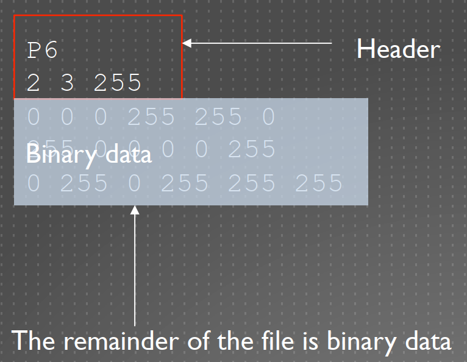
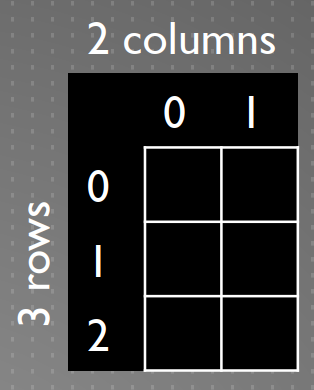
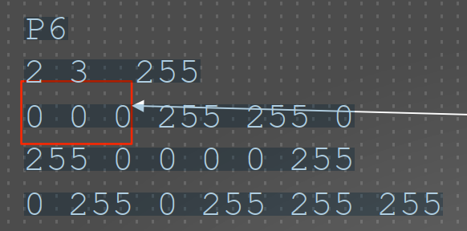
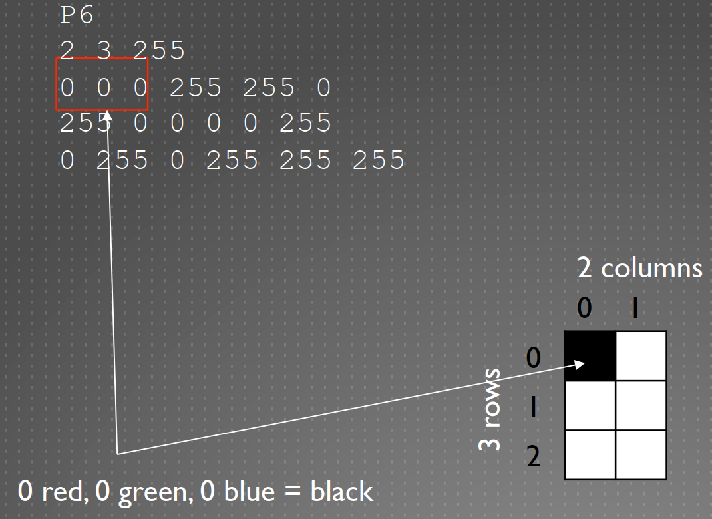
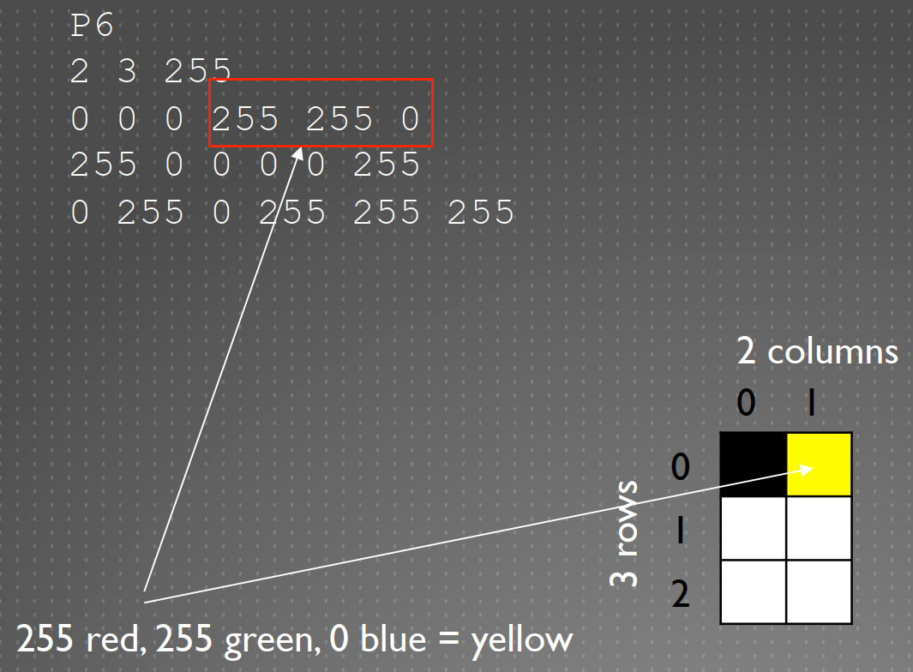
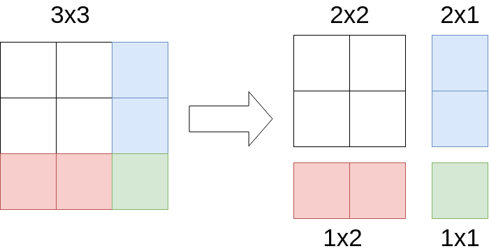
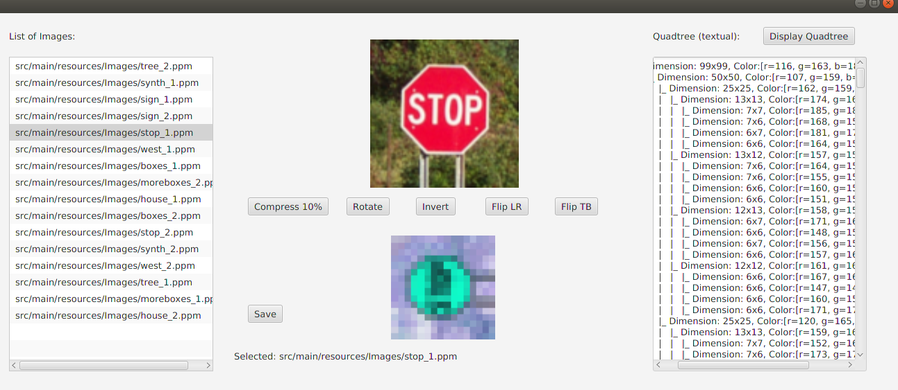

 <h1>Scala Final Project</h1> <i>Course:</i> Functional Programming with SCALA, ADEO-M2 2019  <i>Authors:</i> Alvise de' Faveri Tron, Quoc Viet Pham

## Project Overview

In this project we realized a GUI for manipulating *.ppm* images using **Quadtrees**.  A quadtree is a tree in which each node represents a partition of the image. Starting from the initial image, if all the pixels in the image have the same color the quadtree stores the color of that image, else four *children* (quadtrees) are constructed dividing the image in 4 even partitions. This division is applied recursively until we end up with nodes containing only pixels of the same color.

The program we realized is capable of the following functions:

* Load a *.ppm* image from the `src/main/resources` folder.
* Manipulate the image (90° rotation, invert colors, mirroring top-to-bottom and left-to-right)
* Compress the image by 10% at a time (can be applied as many times as wanted)
* Save the manipulated image
* Convert an image to a quadtree (shown in a textual form)

All functions can be applied to both square and rectangular images.

### PPM Format

PPM - Stands for Portable Pixel Map, images contain two important things:

* Header
* Group of pixels, each pixel has three values RGB (red, green, and blue)

#### Header

This is an example of a header:

|                  PPM file                   |                    Image                    |
| :-----------------------------------------: | :-----------------------------------------: |
|  |  |

**P6**: tells the computer it is a ppm file
**2**: tells the computer the width (columns) of the image is 2 pixels
**3:** tells the computer the height (rows) of the image is 3 pixels
**255**: tells the computer the maximum color value (this is always 255)

#### Pixel Representation

Let's take a sample image: each set of three represents a pixel, with the bytes in this order:

|                    Image                    |                  Encoding                   |
| :-----------------------------------------: | :-----------------------------------------: |
|  | Amount **red** (0-255) Amount **green**(0-255) Amount **blue** (0-255) |

For example:

| First pixel | Second Pixel |
|:-----:|:--------:|
|  |  |

## Image Representation and Manipulation

The image representation can be found in **RgbBitmap.scala**. This class stores an image in the form of a `List[List[java.awt.Color]]` and can be initialized either using a matrix or a flattened matrix (`List[Color`]).

Once initialized, an RgbBitmap can be manipulated as follows:

*  **rotate**: rotates the image 90° counter-clockwise by transposing the matrix and then inverting each row.
* **invert**: inverts the color of the image by creating a new image in which each pixel's RGB component is calculated as 255(white)-initial value.
* **mirroring**: inverts the pixel order of each row (LR) or each column (TB).

### PPM handling

Loading and saving *.ppm* images is enabled by the **BitmapLoader.scala** object, which can generate a RgbBitmap from a *.ppm* file or save an RgbBitmap in a file using the same format. Extensions different from *.ppm* are not supported.

## Quadtree Representation and Compression

### Quadtree from Bitmap

All quadtree-related logic can be found in the **Quadtree.scala** class. This class takes an RgbBitmap as a constructor parameter and a depth level to keep track of the tree's height. Once given an image, the constructor will proceed to build the tree as follows:

- if all the pixel in the image have the same color, stop
- else, divide the image in 4 sub-images and build a quadtree from each of the sub-images. The `color` value of this node will be the mean between the RGB values of the children.

Note that if the image is not squared, or simply the dimension are not a power of 2,  some nodes can have 2 children instead of 4.

Let's take the example of a 3x3 image:

If we divide it in 4 sub-images, we end having a 2x1 matrix and a 1x2 matrix, which obviously cannot be divided in 4.

### Quadtree to Bitmap

This previous consideration is very important also when we convert a quadtree to a RgbBitmap: here, in fact, each node has to know its own width and height to know how it should compose its children. This operation is done in the `toBitmap` function, which has the following logic:

* if the node is a leaf, toBitmap returns a matrix filled with the color (each node knows its color, width and height).
* if it's not a leaf, you have to call toBitmap on your children and concatenate the resulting matrixes. In particulare:
  * if the node has 4 children, concatenate the first two and last two children horizontally, then concatenate vertically
  * if the node has 2 children, either concatenate the children's matrix horizontally or vertically, depending on the width and height stored in the node.

In this way, we can always reconstruct an image from a quadtree.

### Compression

The image compression is done by operating on the quadtree. In particular, to compress an image we:

1. Build a quadtree using the Bitmap
2. Compress the quadtree. This is done by recursively checking the children of each node until you arrive at a depth greater than the desired one. Whenever you reach a node of maximim depth, "cut" the tree (i.e.  delete all the children of the current node).
3. Convert the compressed quadtree back to a Bitmap

## GUI

The GUI has been realized using JavaFX: all GUI elements are defined in `src/main/resources/ImageProcessingWithQuadtree.fxml` and the associated controller is `src/main/scala/GuiController.Scala`.

The main window is divided in 3 columns:

* left: image choice
* middle: image manipulation
* right: quadtree display

The quadtree is represented graphically with a tree-like string which describes the dimension and color stored in each node. Whenever the *display tree* button is pressed, the textarea on the right will contain the tree structure of the manipulated image displayed on the center-bottom panel.

**NOTE: printing the whole quadtree for big images might take a while. We suggest to compress the image before displying the tree structure.**

Clicking the *Save* button will cause the program to generate a *saved.ppm* file containing the last manipulated image.

